# NBA Analytics Project

## Overview

This project explores 74 years of NBA history (1950–2023) using a SQLite database built from four Kaggle datasets. Using SQL embedded in Python, I queried the database to investigate league-wide scoring trends, individual player performance, rookie history, and year-over-year progression. Results are visualized using matplotlib and seaborn.

**Dataset Source:** [NBA Players and Team Data — Kaggle](https://www.kaggle.com/datasets/loganlauton/nba-players-and-team-data?resource=download&select=NBA+Player+Stats%281950+-+2022%29.csv)  
**Data sourced from:** Basketball Reference (player stats) · Hoops Hype (salaries & payroll)

---

## Technical Stack

### SQL Techniques

All queries are written in SQLite and executed via `pd.read_sql_query()`. Key techniques used:

| Technique | Where Used |
|-----------|------------|
| **Common Table Expressions (CTEs)** | Multi-step queries in analyses 3–9 — chains `clean_stats → player_avg → ranked output` |
| **Window Functions** — `RANK() OVER (PARTITION BY ...)` | Rookie scoring leaders — ranks rookies within each season |
| **Window Functions** — `PERCENT_RANK() OVER (ORDER BY ...)` | Player comparison tool  — computes league-wide percentile rank for each stat |
| **Window Functions** — `PERCENT_RANK() OVER (PARTITION BY season ...)` | Availability tax — ranks each player's salary within their own season to filter by relative standing rather than a fixed dollar threshold |
| **Window Functions** — `MAX() OVER ()` | Salary curve by age — indexes production and salary to their own peak in a single pass, no subquery needed |
| **`SUBSTR` + `INSTR`** | Position premium — extracts primary position from compound strings like `"SF-PF"` |
| **`CASE WHEN`** | Scoring tier classification — buckets PPG into 5 tiers |
| **`NOT EXISTS` subquery** | TOT deduplication — removes duplicate rows for traded players |
| **`UNION ALL`** | TOT deduplication — reconstructs a clean, deduplicated dataset |
| **Multi-table `JOIN`** | Year-over-year improvement — joins 2021 and 2022 seasons on player name |
| **`HAVING`** | Consistent scorers — filters players with 5+ qualifying seasons |
| **Manual `STDDEV`** — `SQRT(AVG((x - mean)²))` | Scoring consistency — SQLite lacks a native `STDDEV()`, so population standard deviation is computed inline across game-level rows |
| **Cross-table `JOIN`** on player + team + season | Consistency query — joins `player_boxscores` to `player_stats` on three keys to prevent traded players' box scores from mixing across team stints |
| **Computed columns** | Per-game stats calculated inline: `ROUND(PTS * 1.0 / G, 1) AS PPG` |

**TOT Deduplication Pattern** — used in 6 of 8 analyses to handle players traded mid-season (who appear once per team plus a combined `TOT` row):

```sql
WITH clean_stats AS (
    SELECT * FROM player_stats WHERE Tm = 'TOT'        -- keep the combined row
    UNION ALL
    SELECT * FROM player_stats                          -- keep single-team players
    WHERE NOT EXISTS (
        SELECT 1 FROM player_stats p2
        WHERE p2.Player = player_stats.Player
          AND p2.Season = player_stats.Season
          AND p2.Tm = 'TOT'                             -- only if no TOT row exists
    )
)
```

---

### Python Techniques

| Technique | Library | Where Used |
|-----------|---------|------------|
| SQL → DataFrame bridge | `pandas.read_sql_query()` | All analysis scripts |
| Label overlap prevention | `adjustText.adjust_text()` | Scatter plots with crowded player name labels |
| Unicode normalization | `unicodedata.normalize('NFKD', ...)` | Player name input — handles accented names like "Dončić" → "doncic" |
| Fuzzy string matching | `difflib.get_close_matches()` | Suggests closest player name on typo |
| Polar/radar chart | `matplotlib` with `subplot_kw=dict(polar=True)` | Multi-player percentile comparison |
| Multi-panel subplots | `matplotlib.pyplot.subplots(2, 3)` | Career progression tool |
| Seaborn themes | `seaborn` | Consistent styling across all charts |

---

## Database Schema

The SQLite database (`nba.db`, ~137 MB) contains four tables:

| Table | Description | Rows (approx.) |
|-------|-------------|----------------|
| `player_stats` | Seasonal aggregates per player (1950–2023) | ~30,000 |
| `player_boxscores` | Game-by-game stat lines per player | ~650,000 |
| `salaries` | Individual player salaries with inflation adjustment | ~17,000 |
| `payroll` | Team-level seasonal payroll | ~800 |

---

## Project Structure

```
NBA_SQL/
├── README.md
├── requirements.txt          # Python dependencies
├── load_data.py              # Loads all four CSVs into nba.db
├── queries.sql               # Standalone SQL queries for reference
├── data/                     # Source CSV files (not tracked in git)
├── images/                   # Saved chart outputs
└── visualization/
    ├── utils.py              # Shared: normalize(), build_name_map(), lookup_player()
    ├── analysis1.py          # Q1–Q2: Top scorers, PPG vs APG scatter
    ├── analysis2.py          # Q3: League-wide PPG trend (1950–2023)
    ├── analysis3.py          # Q4: Players with 5+ seasons of 20+ PPG
    ├── analysis4.py          # Q5: Scoring tier distribution in 2022
    ├── analysis5.py          # Q6: Rookie scoring leaders since 1953
    ├── analysis6.py          # Q7: Interactive multi-player radar chart (2022 percentiles)
    ├── analysis7.py          # Q8: Top 3 scorers per team in 2022
    ├── analysis9.py          # Q9: Most improved scorers from 2021 to 2022
    ├── analysis10.py         # Q10: Most consistent scorers in 2022 (game-level std dev)
    ├── analysis11.py         # Q11: Salary efficiency — PPG per $1M (2021)
    ├── analysis12.py         # Q12: Most underpaid and overpaid players by composite production (2021)
    ├── analysis13.py         # Q13: Position premium — salary share vs production share (2021)
    ├── analysis14.py         # Q14: Salary curve by age — when do players peak in pay vs performance?
    ├── analysis15.py         # Q15: Injury/Availability Tax — salary paid for missed games
    ├── analysis15b.py        # Q15b: Same analysis using inflation-adjusted salaries
    └── player_prog.py        # Interactive career progression tool (6-panel chart)
```

---

## Setup & Installation

```bash
# Install dependencies
pip install pandas matplotlib seaborn adjustText

# Build the database from CSV files
python load_data.py

# Run any analysis (example)
python visualization/analysis3.py
```

---

## Analyses

### Q1 · Top 10 Single-Season Scorers of All Time

Query orders all seasons by total points per game and returns the top 10.

```sql
SELECT Player, Season, Tm, PTS
FROM player_stats
ORDER BY PTS DESC
LIMIT 10;
```

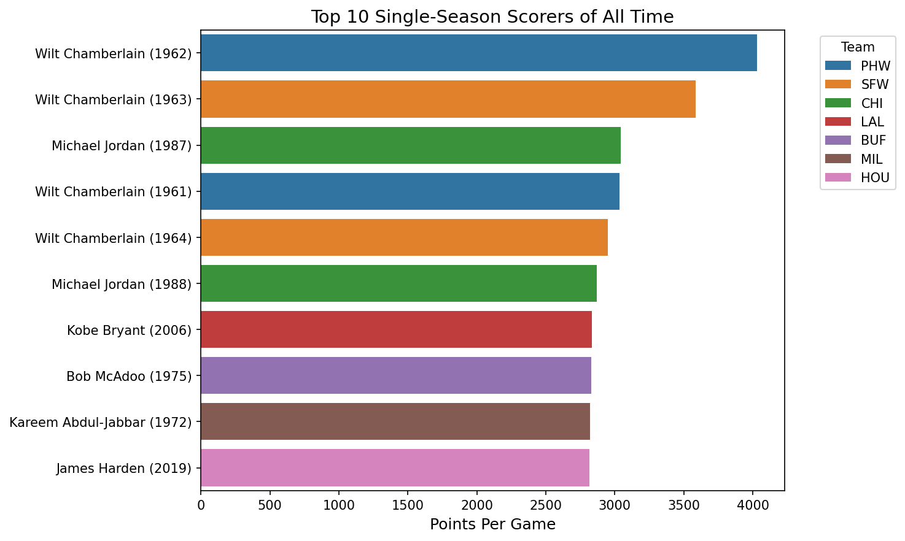

---

### Q2 · Players Averaging 25+ PPG and 7+ APG in a Single Season

Computed columns calculate per-game averages inline. `adjustText` prevents label overlap on the scatter plot.

```sql
SELECT Player, Season, Tm,
    ROUND(PTS * 1.0 / G, 1) AS PPG,
    ROUND(AST * 1.0 / G, 1) AS APG
FROM player_stats
WHERE PPG >= 25 AND APG >= 7 AND G >= 41
ORDER BY PPG DESC;
```

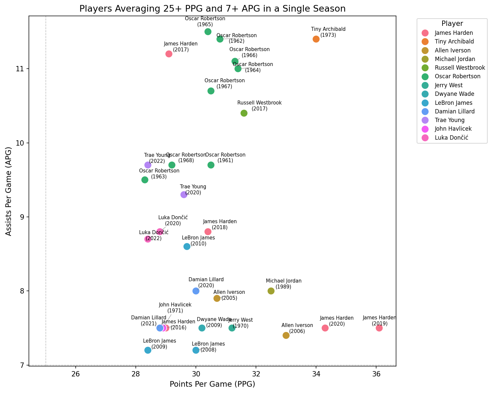

**Finding:** Only a handful of players in NBA history have simultaneously dominated in both scoring and playmaking — Oscar Robertson, Magic Johnson, and LeBron James appear most frequently.

---

### Q3 · League-Wide Average PPG Trend (1950–2023)

A two-step CTE first deduplicates traded players, then averages PPG per season across the full league.

```sql
WITH clean_stats AS ( ... ),   -- deduplicate TOT rows
     player_avg AS (
         SELECT Season, Player, ROUND(PTS / G, 2) AS PPG
         FROM clean_stats WHERE G >= 1
     )
SELECT Season, AVG(PPG) AS avg_PPG, COUNT(*) AS player_count
FROM player_avg
GROUP BY Season ORDER BY Season;
```

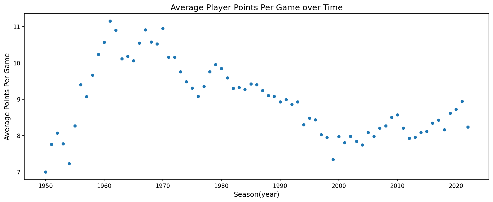

**Finding:** League scoring peaked in the early 1960s, dipped significantly through the defensive era of the 1990s–2000s, and has risen sharply again in the modern three-point era.

---

### Q4 · Players with 5+ Seasons Averaging 20+ PPG

`HAVING` filters groups after aggregation — only players whose count of qualifying seasons meets the threshold survive.

```sql
SELECT Player,
    COUNT(Season)      AS seasons_above_20,
    ROUND(AVG(PPG), 1) AS avg_ppg_in_those_seasons
FROM player_avg
WHERE PPG >= 20
GROUP BY Player
HAVING COUNT(Season) >= 5
ORDER BY seasons_above_20 DESC;
```

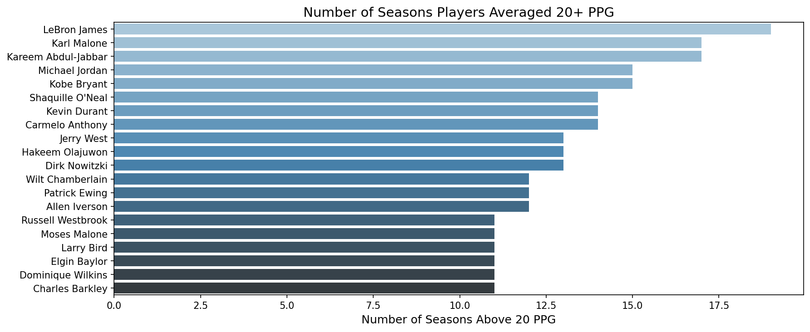

---

### Q5 · Scoring Tier Distribution in 2022

`CASE WHEN` classifies each player into one of five scoring tiers based on their per-game average.

```sql
CASE
    WHEN PPG >= 25 THEN 'Elite (25+)'
    WHEN PPG >= 20 THEN 'Star (20–24)'
    WHEN PPG >= 15 THEN 'Starter (15–19)'
    WHEN PPG >= 10 THEN 'Role Player (10–14)'
    ELSE                'Bench (< 10)'
END AS scoring_tier
```

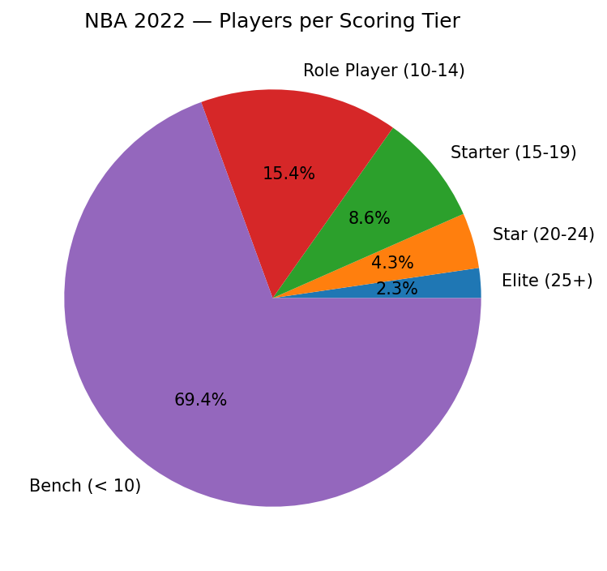

---

### Q6 · Highest-Scoring Rookie Each Year Since 1953

A four-step CTE chain: deduplicate → identify each player's first season → join back for rookie stats → `RANK()` within each season to find the top scorer.

```sql
WITH clean_stats AS ( ... ),
     rookie_year   AS (SELECT Player, MIN(Season) AS rookie_season FROM player_stats GROUP BY Player),
     rookie_stats  AS (SELECT cs.Player, cs.Season, ROUND(cs.PTS / cs.G, 2) AS PPG
                       FROM clean_stats cs JOIN rookie_year ry
                       ON cs.Player = ry.Player AND cs.Season = ry.rookie_season
                       WHERE cs.G >= 20),
     ranked_rookies AS (
         SELECT *, RANK() OVER (PARTITION BY Season ORDER BY PPG DESC) AS ppg_rank
         FROM rookie_stats
     )
SELECT Player, Season, PPG FROM ranked_rookies WHERE ppg_rank = 1 AND Season >= 1953;
```

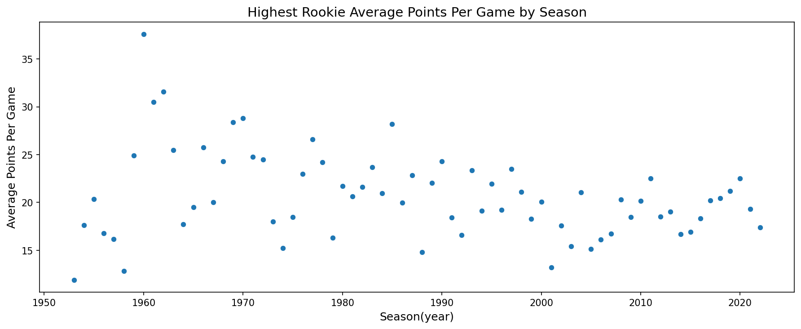

---

### Q7 · Interactive Player Comparison — Percentile Radar Chart

`PERCENT_RANK()` window functions compute each player's league-wide percentile rank across five stats simultaneously. The radar chart is drawn using matplotlib's polar projection.

```sql
SELECT Player,
    ROUND(PERCENT_RANK() OVER (ORDER BY PPG) * 100, 1) AS pts_percentile,
    ROUND(PERCENT_RANK() OVER (ORDER BY APG) * 100, 1) AS ast_percentile,
    ROUND(PERCENT_RANK() OVER (ORDER BY RPG) * 100, 1) AS reb_percentile,
    ROUND(PERCENT_RANK() OVER (ORDER BY SPG) * 100, 1) AS stl_percentile,
    ROUND(PERCENT_RANK() OVER (ORDER BY BPG) * 100, 1) AS blk_percentile
FROM league_2022;
```

**Interactive features:**
- Comma-separated input accepts multiple player names
- `unicodedata.normalize()` maps accented names (e.g. `Dončić`) to plain ASCII input
- `difflib.get_close_matches()` suggests the closest match on typos with a yes/no/stop prompt to simplify user interaction
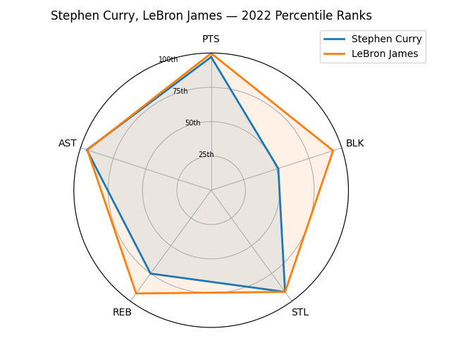

---

### Q8 · Who were the top 3 scorers on each team in the 2022 season?
Three CTEs that isolate data from the 2022 season, find each team's total points, partition the player data based on teams, and assign rankings based on total points. 

```sql
  WITH clean_2022 AS (
      -- Remove TOT rows; keep individual team rows only
      SELECT Player, Tm, G, PTS                                                                                                                    
      FROM player_stats
      WHERE Season = 2022                                                                                                                          
        AND G >= 1                                      
        AND Tm != 'TOT'
  ),                                                                                                                                               
  team_totals AS (
      -- Sum all player points per team to get a sortable team score                                                                               
      SELECT Tm, SUM(PTS) AS team_total_pts                                                                                                        
      FROM clean_2022
      GROUP BY Tm                                                                                                                                  
  ),                                                    
  ranked_players AS (
      -- Rank each player within their team by individual PTS
      SELECT                                                                                                                                       
          Player, Tm, G, PTS,
          RANK() OVER (PARTITION BY Tm ORDER BY PTS DESC) AS team_ranking                                                                          
      FROM clean_2022                                   
  )                                                                                                                                                
  SELECT                                                
      r.Tm,
      t.team_total_pts,
      r.team_ranking,                                                                                                                              
      r.Player,
      r.PTS,                                                                                                                                       
      r.G                                               
  FROM ranked_players r
  JOIN team_totals t ON r.Tm = t.Tm
  WHERE r.team_ranking <= 3                                                                                                                        
  ORDER BY t.team_total_pts DESC, r.team_ranking;

```
---
### Q9 · Most Improved Scorers from 2021 to 2022

Three CTEs isolate each season's data, then a `JOIN` on player name links a player's 2021 and 2022 stats to compute the improvement delta.

```sql
WITH season_2021 AS (SELECT Player, ROUND(PTS * 1.0 / G, 1) AS PPG_2021 FROM clean_stats WHERE Season = 2021 AND G >= 20),
     season_2022 AS (SELECT Player, Tm, ROUND(PTS * 1.0 / G, 1) AS PPG_2022 FROM clean_stats WHERE Season = 2022 AND G >= 20),
     combined    AS (SELECT s22.Player, s21.PPG_2021, s22.PPG_2022,
                            ROUND(s22.PPG_2022 - s21.PPG_2021, 1) AS improvement
                     FROM season_2022 s22 JOIN season_2021 s21 ON s22.Player = s21.Player)
SELECT * FROM combined ORDER BY improvement DESC LIMIT 10;
```

---

### Q10 · Most Consistent Scorers in 2022

Uses both `player_stats` and `player_boxscores` to compute scoring standard deviation at the game level. A low std_dev against a high avg_ppg signals a player who reliably delivers their scoring output every night, rather than alternating between big games and quiet ones.

```sql
WITH season_avgs AS (
    SELECT Player, Tm, G, ROUND(PTS * 1.0 / G, 1) AS avg_ppg
    FROM player_stats
    WHERE Season = 2022 AND G >= 40 AND Tm != 'TOT'
),
consistency AS (
    SELECT pb.PLAYER_NAME, pb.Team, sa.G AS games_played, sa.avg_ppg,
        ROUND(SQRT(AVG((pb.PTS - sa.avg_ppg) * (pb.PTS - sa.avg_ppg))), 1) AS std_dev
    FROM player_boxscores pb
    JOIN season_avgs sa
        ON  pb.PLAYER_NAME = sa.Player
        AND pb.Team        = sa.Tm
        AND pb.Season      = 2022
    GROUP BY pb.PLAYER_NAME, pb.Team, sa.avg_ppg, sa.G
)
SELECT PLAYER_NAME, Team, games_played, avg_ppg, std_dev
FROM consistency
WHERE avg_ppg >= 15
ORDER BY std_dev ASC LIMIT 15;
```

Standard deviation is calculated manually using `SQRT(AVG((game_pts - season_avg)²))` — SQLite has no built-in `STDDEV()` function. Joining on both player name **and** team is essential: a traded player would otherwise pick up box score rows from multiple teams, mixing stats from different stints under a single average.

| Player | Team | Games | Avg PPG | Std Dev |
|---|---|---|---|---|
| Jalen Brunson | DAL | 79 | 16.3 | 5.0 |
| Rudy Gobert | UTA | 66 | 15.6 | 5.2 |
| Wendell Carter Jr. | ORL | 62 | 15.0 | 5.3 |
| Evan Mobley | CLE | 69 | 15.0 | 5.5 |
| Andrew Wiggins | GSW | 73 | 17.2 | 5.6 |
| Jarrett Allen | CLE | 56 | 16.1 | 5.8 |
| Cole Anthony | ORL | 65 | 16.3 | 6.1 |
| Dejounte Murray | SAS | 68 | 21.1 | 6.2 |
| Jaren Jackson Jr. | MEM | 78 | 16.3 | 6.3 |
| Tobias Harris | PHI | 73 | 17.2 | 6.3 |
| Norman Powell | POR | 40 | 18.6 | 6.4 |
| Bam Adebayo | MIA | 56 | 19.1 | 6.5 |
| Scottie Barnes | TOR | 74 | 15.3 | 6.5 |
| Seth Curry | PHI | 45 | 15.0 | 6.5 |
| Russell Westbrook | LAL | 78 | 18.5 | 6.7 |

**Finding:** Jalen Brunson leads all 15+ PPG scorers in consistency, posting the lowest std_dev of 5.0 across 79 games. Notably, several of the most consistent scorers here — Brunson, Mobley, Wiggins, Barnes — were all in the early stages of becoming primary offensive options, suggesting that players who haven't yet reached star-level usage tend to produce more predictably within defined roles.

---

### Q11 · Salary Efficiency — Scoring Value per Dollar Spent (2021)

Joins `player_stats` with `salaries` to compute PPG per $1M of salary, identifying which players deliver the most scoring value relative to their contract. Players with fewer than 41 games played are excluded to avoid small-sample inflation.

```sql
SELECT Player, Tm, G, PPG, salary_millions,
    ROUND((cs.PTS * 1.0 / cs.G) / (sal.salary_int / 1000000.0), 2) AS ppg_per_million
FROM player_value
ORDER BY ppg_per_million DESC;
```

The scatter plot colours each point on a `RdYlGn` scale — green = high value per dollar, red = low. Only the top 10 and bottom 5 by efficiency are labelled; `adjustText` prevents overlap.

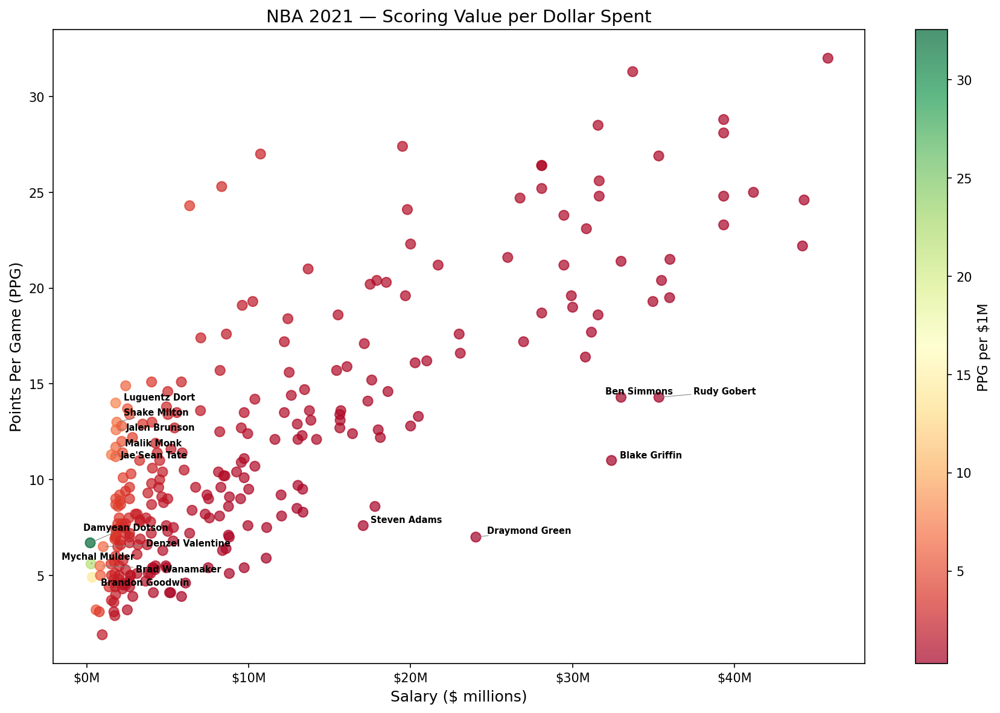

**Finding:** High-profile defenders and playmakers — Rudy Gobert, Steven Adams, Draymond Green — rank among the most expensive players by PPG cost, but their value lies primarily outside scoring. This metric systematically undervalues players whose contributions show up in defense, rebounding, and facilitating rather than the scoring column.

---

### Q12 · Most Underpaid and Overpaid Players by Composite Production (2021)

Replaces PPG with a composite production score — `(PTS + TRB + AST + STL + BLK − TOV) / G` — and computes cost per production unit. Players at minimum salary are excluded since artificially low salaries would inflate the metric regardless of performance.

```sql
ROUND(s.salary_int / 1000000.0 / p.prod_per_game, 2) AS cost_per_unit,
RANK() OVER (ORDER BY cost_per_unit ASC)  AS underpaid_rank,
RANK() OVER (ORDER BY cost_per_unit DESC) AS overpaid_rank
```

The top 10 underpaid and top 5 overpaid players are labelled on the scatter. The `RdYlGn_r` colourmap is reversed so green = cheap (good value) and red = expensive (poor value).
The top 10 mot

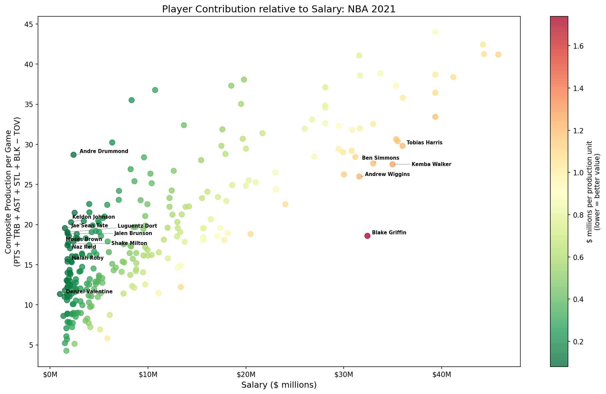

**Finding:** The composite metric appears to track player development well. Jalen Brunson was among the most undervalued players in 2021 by this measure and has since emerged as the franchise player of the New York Knicks. Naz Reid is another example — a high-production, low-cost contributor at the time who has since grown into a key rotation piece.

---

### Q13 · Position Premium — Which Positions Does the Market Over/Underpay? (2021)

Computes each position's share of total salary and total production, then derives a premium ratio. A value above 1.0 means the market pays that position a larger salary share than its production share warrants.

```sql
ROUND(
    (avg_salary / SUM(avg_salary) OVER ()) /
    (avg_prod   / SUM(avg_prod)   OVER ()),
2) AS position_premium
```

`SUM() OVER ()` computes the league-wide total in a single pass — no subquery or self-join needed. Primary position is extracted from mixed positions like `"SF-PF"` using `SUBSTR(Pos, 1, INSTR(Pos || '-', '-') - 1)`.

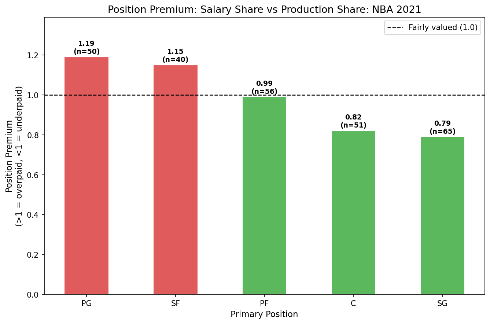

**Finding:** Shooting guards are the most underpaid position relative to their production share, though this likely reflects roster depth — teams carry more guards, diluting average salary. Point guards are the most overpaid by this measure, but the metric undersells their true value: as primary ball-handlers and playmakers, their impact is disproportionately captured in assists and decision-making rather than the composite production score. The star-player premium also concentrates at this position, inflating the average.

---

### Q14 · Salary Curve by Age — When Do Players Peak in Pay vs Performance?

Aggregates all seasons with salary data (1990–2021) and computes average production score and average salary at each age. Both curves are then indexed to their own peak (100 = peak age) so they can be overlaid on the same axis despite having different units.

```sql
ROUND(avg_prod   / MAX(avg_prod)   OVER () * 100, 1) AS prod_index,
ROUND(avg_salary / MAX(avg_salary) OVER () * 100, 1) AS salary_index
```

The chart shades the gap between the production peak and the salary peak, visualising the lag between when players perform best and when the market pays them most. This lag reflects how contracts are typically signed based on past performance.

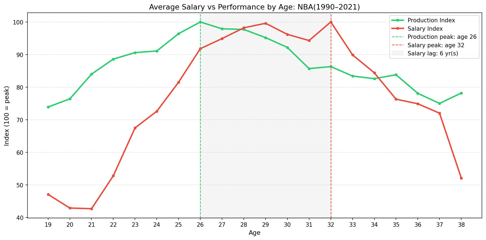

**Finding:** Production peaks earlier than pay — players tend to be at their best on-court in their mid-to-late 20s, but maximum salary often arrives two to three years later. Since NBA contracts typically run no longer than four years, this gap reflects the inherent delay between demonstrated performance and the next contract negotiation cycle.

---

### Q15 · Injury / Availability Tax — How Much Do Teams Pay for Players Who Don't Play?

Two queries drive three panels: the top 10 player-seasons by salary wasted on missed games, an availability-vs-salary scatter, and a league-wide trend of average availability rate and qualifying player count over time.

**Query 1 — per-player salary wasted:**

```sql
WITH clean_stats AS ( ... ),   -- TOT deduplication
clean_salaries AS (
    SELECT DISTINCT playerName, seasonStartYear,
        CAST(REPLACE(REPLACE(salary, ',', ''), '$', '') AS INTEGER) AS salary_int
    FROM salaries
),
per_player AS (
    SELECT cs.Player, cs.Season, cs.G,
        ROUND(cs.G * 1.0 / 82, 3)                             AS availability_rate,
        ROUND(s.salary_int / 1000000.0, 2)                    AS salary_millions,
        -- salary * (1 - G/82) = cost of missed game slots
        ROUND(s.salary_int / 1000000.0 * (1.0 - cs.G / 82.0), 2) AS salary_wasted_m
    FROM clean_stats cs
    JOIN clean_salaries s ON cs.Player = s.playerName AND cs.Season = s.seasonStartYear
    WHERE s.salary_int > 5000000 AND cs.G < 82
)
SELECT * FROM per_player ORDER BY salary_wasted_m DESC;
```

**Query 2 — league-wide availability by season (relative salary filter):**

A fixed dollar threshold like `salary > $5M` distorts comparisons across eras — the same nominal amount represents a far larger share of the salary cap in 1995 than in 2020. Instead, `PERCENT_RANK()` partitioned by season ranks each player's salary within their own year, and the filter keeps only those above the median. This ensures a consistent "above-average earner" definition regardless of the league's economic scale.

```sql
WITH ...,
salary_pct AS (
    SELECT playerName, seasonStartYear, salary_int,
        PERCENT_RANK() OVER (
            PARTITION BY seasonStartYear
            ORDER BY salary_int
        ) AS salary_percentile
    FROM clean_salaries
)
SELECT cs.Season, COUNT(*) AS num_players, ROUND(AVG(cs.G * 1.0 / 82), 3) AS avg_availability
FROM clean_stats cs
JOIN salary_pct s ON cs.Player = s.playerName AND cs.Season = s.seasonStartYear
WHERE s.salary_percentile >= 0.5   -- above median salary for that season
GROUP BY cs.Season ORDER BY cs.Season;
```

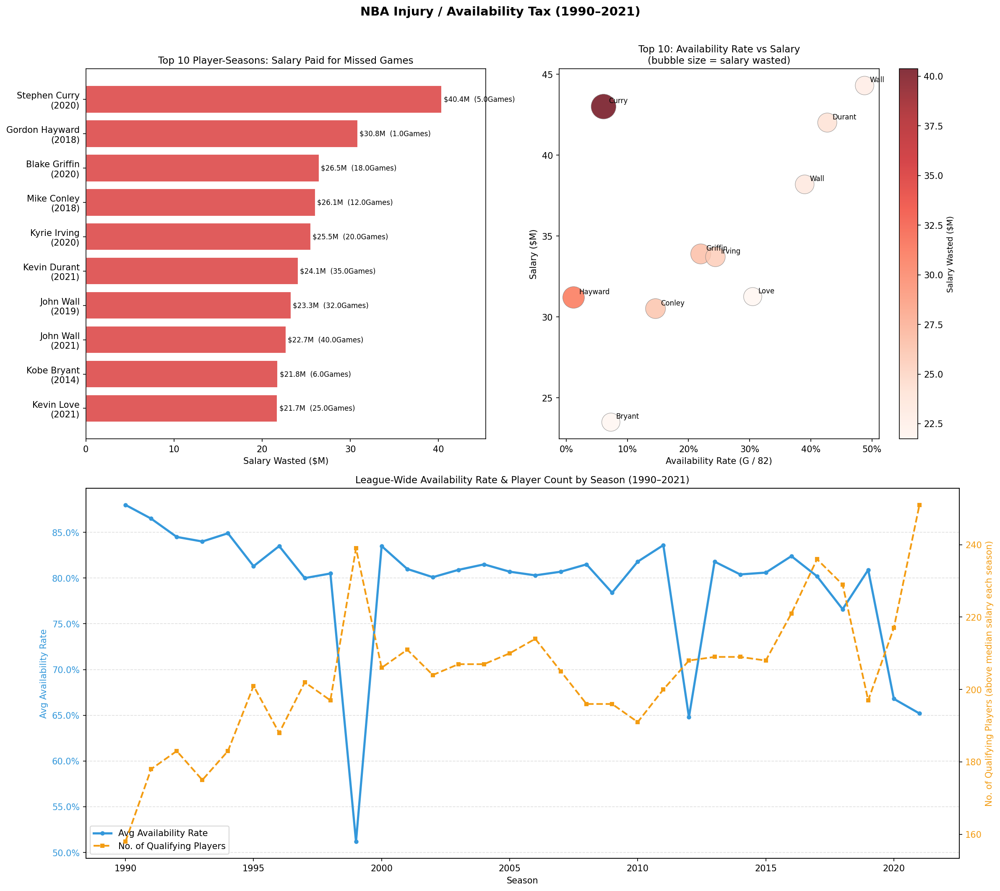

**Finding:** The chart reveals two simultaneous anomalies around 1998–99: a sharp spike in qualifying player count and a steep dip in average availability rate. These have distinct causes that collide at the same moment in NBA history.

The **player count spike** traces to league expansion. Between 1988 and 1995, the NBA added six franchises — the Heat, Hornets, Timberwolves, Magic, Raptors, and Grizzlies — growing from 23 to 29 teams. Each new franchise added roughly 12–15 roster spots, steadily expanding the pool of salaried players captured in the data. By the late 1990s this cumulative growth peaks, producing the visible surge in the orange line.

The **availability rate dip** is a direct artifact of the 1998–99 labor lockout. The collective bargaining dispute shortened that season to just 50 games. Since availability is measured as `G / 82`, even a player who appeared in every single game that year registers only a ~0.61 rate — a hard ceiling imposed by the compressed schedule, not by injury. This mechanically drags the league-wide average down in a single season, creating the sharp trough in the blue line.

The two effects are not contradictory: expansion inflated the player count through the mid-to-late 1990s, while the lockout compressed everyone's availability in the same window. The two lines are responding to entirely different forces that happened to converge at the same point in time.

---

### Q15b · Injury / Availability Tax — Inflation-Adjusted

Identical structure to Q15 but uses `inflationAdjSalary` (all values expressed in 2021 dollars) instead of nominal salary. This makes the salary wasted figures directly comparable across eras — a $20M loss in 1999 and a $20M loss in 2019 carry the same real-dollar weight.

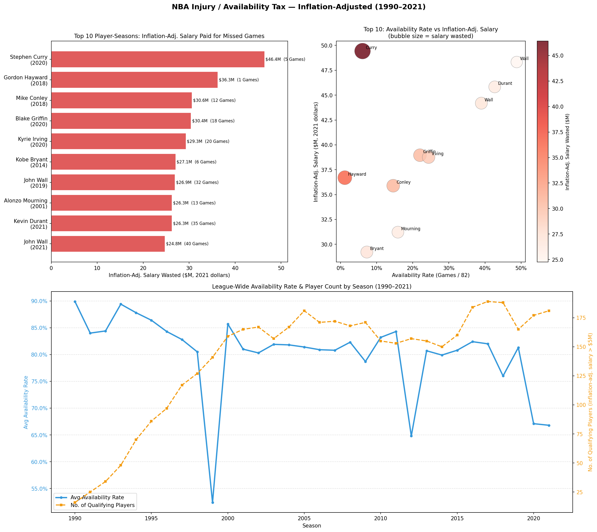

---

## Interactive Tool — Career Progression (`player_prog.py`)

Visualizes any player's career arc across six dimensions in a single 2×3 grid.

```bash
python player_prog.py
# Enter player name: michael jrdan
# → 'michael jrdan' not found. Did you mean 'Michael Jordan'? (yes/no/stop): yes
```

- Pulls all career seasons via the `clean_stats` CTE
- Per-game stats (PPG, APG, RPG, SPG, BPG) computed per season
- 6th panel shows games played as a bar chart to contextualize injury seasons

---

## Key Findings

- **Wilt Chamberlain** holds the all-time single-season scoring record at **50.4 PPG** (1961–62), nearly 10 points ahead of anyone else in history.
- Only **~4% of NBA players** in 2022 qualified as "Elite" scorers (25+ PPG); over half fell into the "Bench" tier.
- League-wide scoring has returned to 1960s levels after a defensive valley spanning roughly 1994–2010.
- The **modern three-point era** has produced some of the highest-scoring rookie classes since the 1960s.
- Fewer than 15 players in the dataset have ever averaged 20+ PPG in 5 or more seasons.
- A **PPG-per-dollar** metric systematically undervalues non-scorers — defenders and playmakers like Draymond Green and Rudy Gobert appear expensive, but their real value lies outside the scoring column.
- A **composite production score** (points + rebounds + assists + steals + blocks − turnovers) identified Jalen Brunson and Naz Reid as severely undervalued in 2021 — both have since grown into key rotation or franchise-level players.
- **Point guards** carry the highest position premium in the market; **shooting guards** are the most underpaid relative to their production share, likely because teams carry more guards, which dilutes position-wide salary averages.
- **Production peaks before pay** — players tend to perform best in their mid-to-late 20s, but maximum salary typically arrives two to three years later, reflecting the lag between performance and the next contract cycle.
- The **1998–99 availability anomaly** has two separate causes: NBA expansion through the mid-1990s inflated the player pool, while the labor lockout compressed that season to 50 games — mechanically capping every player's availability rate regardless of health.

---

## Potential Extensions

- **Hot streak analysis** — Use the `player_boxscores` table to find the longest consecutive 20+ point games
- **Team payroll vs. win rate** — Correlate team spending with win percentage across seasons
- **Streamlit dashboard** — Deploy analyses as an interactive web app
- **Defense-adjusted salary efficiency** — Add defensive stats (BLK, STL, defensive rating) to the PPG-per-dollar metric so that non-scorers like Gobert and Draymond are valued fairly
- **Breakout player tracker** — Check how players flagged as "undervalued" by the composite score in year N perform in years N+1 and N+2; test whether the metric predicts development
- **Position salary trends over time** — Track how each position's market premium has shifted decade by decade as the game has evolved (e.g. the rise of the 3-and-D wing, the decline of the traditional center)
- **Contract value model** — Use production score and age to estimate expected salary, then flag players who are priced significantly above or below their performance curve
- **Availability by position and age** — Break down the availability tax analysis by position and age group to see whether certain roles or career stages carry higher injury risk


## What I Learned

This is my second SQL project and my first time combining SQL with Python. Moving from a clean tutorial database to raw, real-world data meant confronting problems I had to solve independently — the most significant being that traded players appear multiple times per season. Recognizing that pattern and writing a `NOT EXISTS` deduplication CTE to resolve it was one of the more satisfying parts of the project, and it reinforced how important understanding your data's structure is before writing any analysis.

Connecting SQL to Python via `pandas` made data visualization a natural next step. I learned to match the question being asked to the right chart format: bar charts for rankings, scatter plots for correlations and trends, pie charts for distributions. Building the interactive tools pushed me further — anticipating how a real user would interact with the input prompted me to research and implement Unicode normalization and fuzzy string matching, neither of which I had used before.

The salary analyses pushed me into different territory. Designing metrics like PPG-per-dollar and a composite production score meant making deliberate choices about what to include and exclude — and then thinking critically about where those metrics break down. A defender like Draymond Green looks expensive by a scoring-only measure, but that's a flaw in the metric, not the player. I found that stress-testing my own analysis was just as important as building it.

It also changed how I thought about comparisons across time. A fixed `$5M` salary filter means something very different in 1995 than in 2020, so I replaced it with a `PERCENT_RANK()` window function partitioned by season — keeping only players above the median salary for their own era. That felt like a more honest question to ask. Similarly, investigating the 1998–99 anomaly in the availability data taught me to separate data artifacts from real signal: the dip wasn't an injury trend, it was the lockout mechanically capping every player's game total at around 50. Without that historical context, it would have been easy to draw the wrong conclusion.
